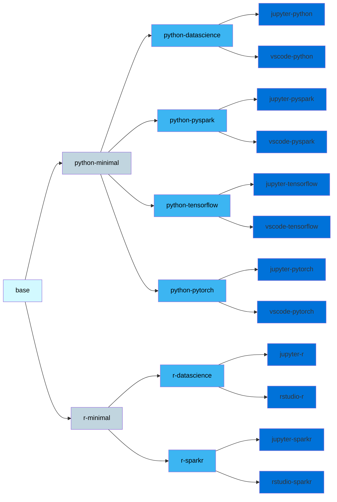

[](https://github.com/InseeFrLab/images-datascience/actions/workflows/main-workflow.yml)
# images-datascience
A collection of Docker images for ready-to-run datascience services.

They can be used alone but are designed to work with the [Onyxia](https://github.com/InseeFrLab/onyxia-web) ecosystem.

## Conception

4 layers:
- base layer ubuntu and nvidia's ubuntu-cuda adding some base binaries 
- a layer to add on this base some python and R versions (currently, 2 different versions supported for each programming language)
- a layer to add on this python and R images some coherent bundle experience classic datascience packages, spark,  tensorflow and pytorch 
- a layer to put on the top of that some ide like jupyter, rstudio or vscode


## Environment variable

List of environment variable you can use to pimp the container at init:

If helm chart support is checked, it means that environment variable behavior is supported in https://github.com/InseeFrLab/helm-charts-interactive-services

If Onyxia support is checked, it means that the Onyxia product could inject automatically the environment variable based on onyxia-web behavior or onyxia-api region configuration.


|   environment variable   |   Example | Description |  helm chart support |   Onyxia support   |
|---    |:-:    |:-:    |:-:    |:-:     |
| PIP_REPOSITORY   | https://some.entreprise.mirror/repository/pypi-proxy/simple   | Configure an externally managed pip repository manager   | ✔️   | ✔️  |
| CONDA_REPOSITORY | https://some.entreprise.mirror/repository/conda-proxy/main   |  Configure an externally managed conda repository manager   |✔️   |✔️    |
| R_REPOSITORY | https://some.entreprise.mirror/repository/cran   |  Configure an externally managed cran repository manager   |not yet (*)   | not yet  (*)   |
| PATH_TO_CA_BUNDLE  | /etc/ssl/certs/ca-certificates.crt  | Configure a path to a ca bundle with autorities to support an auto-signed some.entreprise.mirror   | not yet (*)   | not yet (*)    |

(*) For now you should inject this another way, contact on onyxia slack for some recipes depend of your context.

There is multiple recipes:

**Your user has non root capabilities:**
- use an init script : https://github.com/InseeFrLab/images-datascience/blob/main/base/common-scripts/onyxia-init.sh#L7
- you can use an init region script location injected by Onyxia with a curl to an endpoint with your certiticates and put it in a path let's say /tmp/ca-certificates:
- put this path in env variable PATH_TO_CABUNDLE then onyxia-init.sh script will configure git, pip and conda to user this certificates.

```
runAsNonRoot: true
allowPrivilegeEscalation: false
```
**Your user have root capabilities:**
- you can do the same but also point on system bundle doing an appropriate update-ca-certificates in your region script.

**Other recipes out of the scope of onyxia :**
- kubernetes injection: you rely on some kubernetes global certificate injection then use kyverno/gatekeeper to enforce PATH_TO_CABUNDLE to the injected path.
  - soon PATH_TO_CA_BUNDLE will be an injected field of the onyxia region.

- rebuild of images just to add certificates: you can also rebuild the images in your entreprise just to add ca certificates with this same recipe relying on a PATH_TO_CABUNDLE.

As far as we know, if you target a non root environment with custom authorities bundle in the system store, onyxia can't do this you should rely on this kind of recipes out of the scope of onyxia.

**full onyxia recipe:**

Not developped yet we have 2 paths at least:
- onyxia-api could show an endpoint like https://onyxiaurl/public/certs and let the onyxia-init.sh curl the certs in PATH_TO_CABUNDLE path.
- we cloud also rely on a field on the region https://github.com/InseeFrLab/onyxia-api/blob/master/docs/region-configuration.md#certificateauthorityinjection-properties to let the encodedbase64 list of certificates going thrown the ui and be injected to puopulate a configmap and inject this certificates in a PATH_TO_CABUNDLE directory.


## Freshness and rebuild

A new set of images are built every monday at 02:00.
