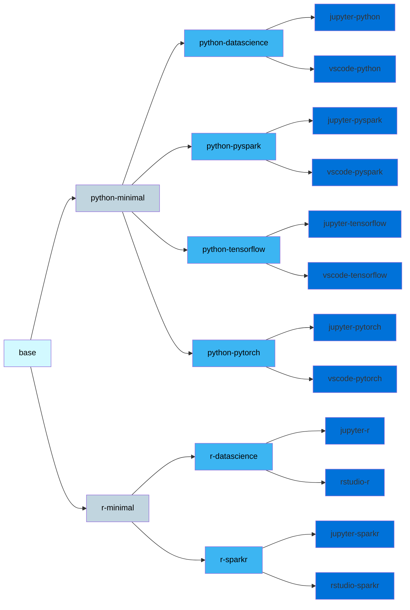

# images-datascience
A collection of Docker images for ready-to-run datascience services.

They could be used alone and are designed to work with Onyxia ecosystem.

## conception of this images

4 layers:
- base layer ubuntu and ubuntu-gpu adding some base binaries 
- a layer to add on this base some python and R versions and python version (actually 2 versions supported)
- a layer to add on this python and R images some coherent bundle experience classic datascience packages, spark,  tensorflow and pytorch 
- a layer to put on the top of that some ide like jupyter, rstudio or vscode

## Environment variable

List of environment variable you can use to pimp the container at init:

If helm chart support is checked, it means that environment variable behavior is supported in https://github.com/InseeFrLab/helm-charts-interactive-services

If Onyxia support is checked, it means that the Onyxia product could inject automatically the environment variable based on onyxia-web behavior or onyxia-api region configuration.

|   environment variable   |   Example | Description |  helm chart support |   Onyxia support   |
|---    |:-:    |:-:    |:-:    |:-:     |
| PIP_REPOSITORY   | https://some.entreprise.mirror/repository/pypi-proxy/simple   | Configure an externally managed pip repository manager   | ✔️   | not yet (*)  |
| CONDA_REPOSITORY | https://some.entreprise.mirror/repository/conda-proxy/main   |  Configure an externally managed conda repository manager   |✔️   | not yet  (*)   |
| PATH_TO_CA_BUNDLE  | /etc/ssl/certs/ca-certificates.crt  | Configure a path to a ca bundle with autorities to support an auto-signed some.entreprise.mirror   | not yet    | not yet (*)    |

(*) For now you should inject this another way, contact on onyxia slack for some recipes depend of your context.

## Freshness and rebuild

This image are build every monday at 00:00
